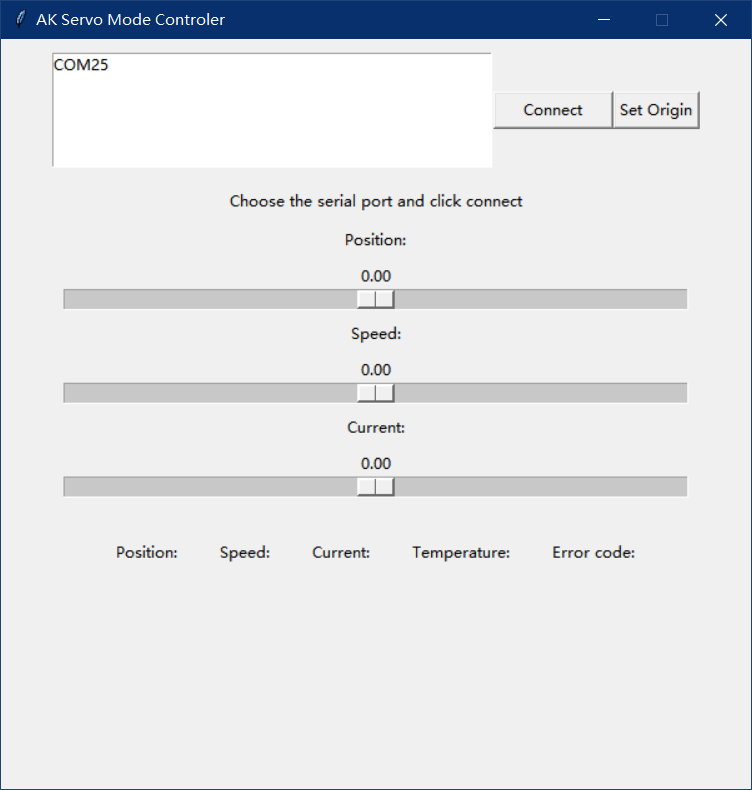
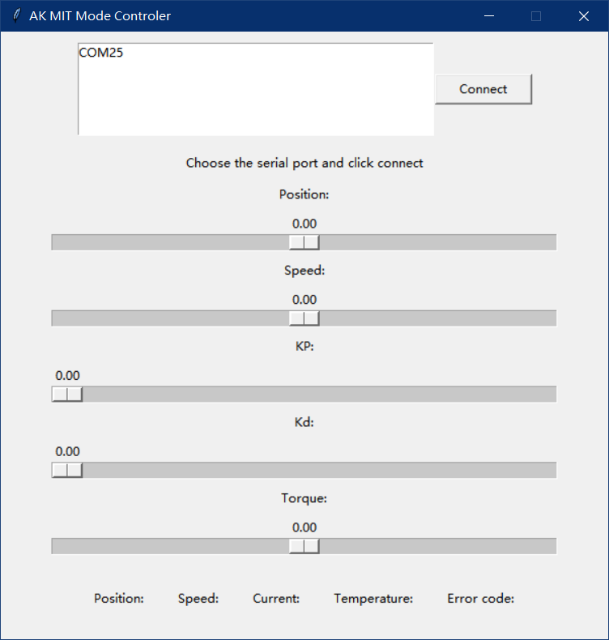

# STM32驱动T-motor电机示例代码 #

理论支持AK10-9，AK60-6，AK70-10，AK80-6，AK80-9，AK80-80/64，AK80-8电机，目前只用了AK80-8电机实验

使用STM32F429驱动，CAN波特率为1Mbps

HAL Version: V1.8.1 / 24-June-2022

ARM Clang 6.21，C11/C++11标准。可以在ARM CC 5.06下编译通过

感谢[NikodemBartnik](https://github.com/NikodemBartnik)的Python代码

# 用法 #

实例化`AK_Motor_Class`对象，指定`CAN ID`和电机型号

```
AK_Motor_Class AK_Servo_Instance(104U, AK80_8);
```


`AK_Motor_Class`类有以下属性可以获取电机参数

```
bool id_conflict;               /*!< CAN ID是否冲突 */
float motor_pos;                /*!< 电机位置 */
float motor_spd;                /*!< 电机速度 */
float motor_cur_troq;           /*!< 电机电流, 运控模式为扭矩 */
int8_t motor_temperature;       /*!< 电机温度 */
uint8_t error_code;             /*!< 电机错误码 */
```

`id_conflict`属性为`true`说明已经有相同`CAN ID`的电机了，这个对象收到CAN消息后不会给属性赋值，但可以控制电机。如果有多处函数需要控制电机并获取参数，考虑公开电机对象。

当CAN收到消息以后会自动判断是运控模式还是伺服模式并赋值。

## 伺服模式 ##

在伺服模式可以使用以下方法，每个函数的使用参照注释和手册

```
void comm_can_set_duty(float duty);
void comm_can_set_current(float current);
void comm_can_set_cb(float current);
void comm_can_set_rpm(float rpm);
void comm_can_set_pos(float pos);
void comm_can_set_origin(uint8_t set_origin_mode);
void comm_can_set_pos_spd(float pos, float spd, float RPA);
```

`servo_demo`可以用`servo_mode_ctrl.py`控制，点击Connect，拖动滑块条就可以让电机运动



## 运控模式 ##

在运控模式下可以使用以下方法，每个函数的使用参照注释和手册，**必须先调用`mit_can_enter_motor`方法才可以控制电机！**

```
void mit_can_enter_motor(void);
void mit_can_set_origin(void);
void mit_can_send_data(float pos,
                       float spd,
                       float kp,
                       float kd,
                       float torque);
void mit_can_exit_motor(void);
```

`mit_demo`可以用`mit_mode_ctrl.py`控制，先按KEY0，板子上LED0灯亮，此时AK电机亮绿灯说明连接正常。点击Connect，拖动滑块条就可以让电机运动



按KEY1可以退出控制模式，板子上LED0灯灭。此时AK电机绿灯灭

# 参考 #

https://github.com/Yangwen-li13/CubeMars-AK60-6/

https://github.com/NikodemBartnik/Overpowered-Robotic-Chassis

https://www.cubemars.com/article.php?id=261
